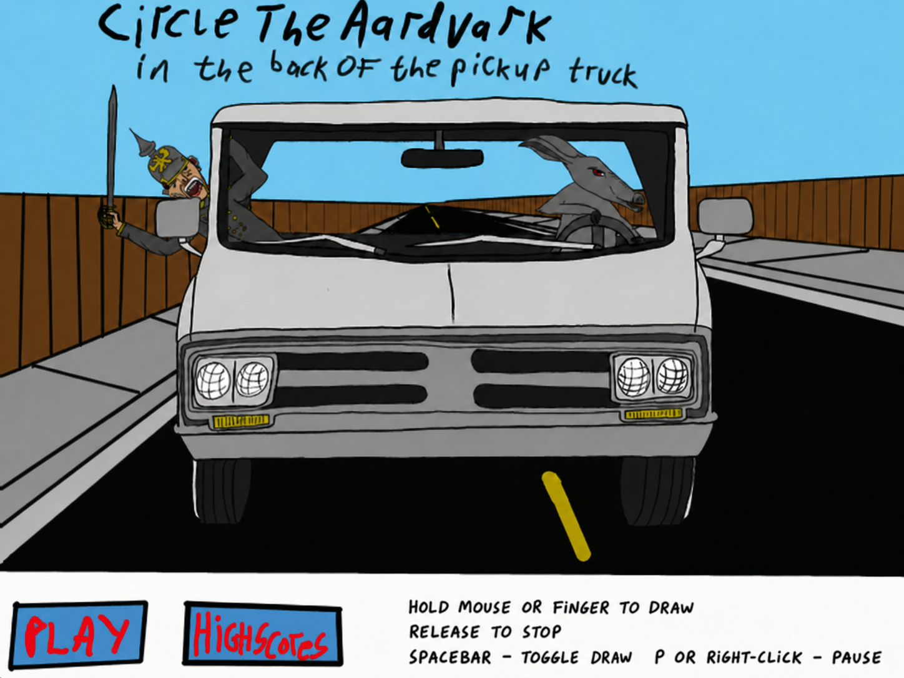
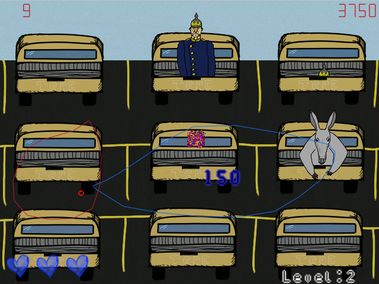

# Circle the Aardvark in the Back of the Pickup Truck

A browser port of the original Monkey X game. Circle aardvarks in pickup trucks, avoid Otto von Bismarck, and watch for disguises in later levels.





## Development

```sh
npm install
npm run dev
```

Use the mouse, a stylus, or touch to draw a self-crossing loop. Press `P`, `Escape`, or right-click to pause. Space toggles keyboard-assisted drawing at the cursor.

Run `npm run check` for linting, formatting, unit tests, and a production build. Run `npm run test:e2e` for browser tests.

The production build uses relative asset URLs and can be deployed as a static GitHub Pages site. Scores are stored locally in the browser.

## Credits

Music: "Cascade", Locate The Source, Moscow Idaho, 2009. [MySpace Music](https://myspace.com/locatethesource/music/songs)